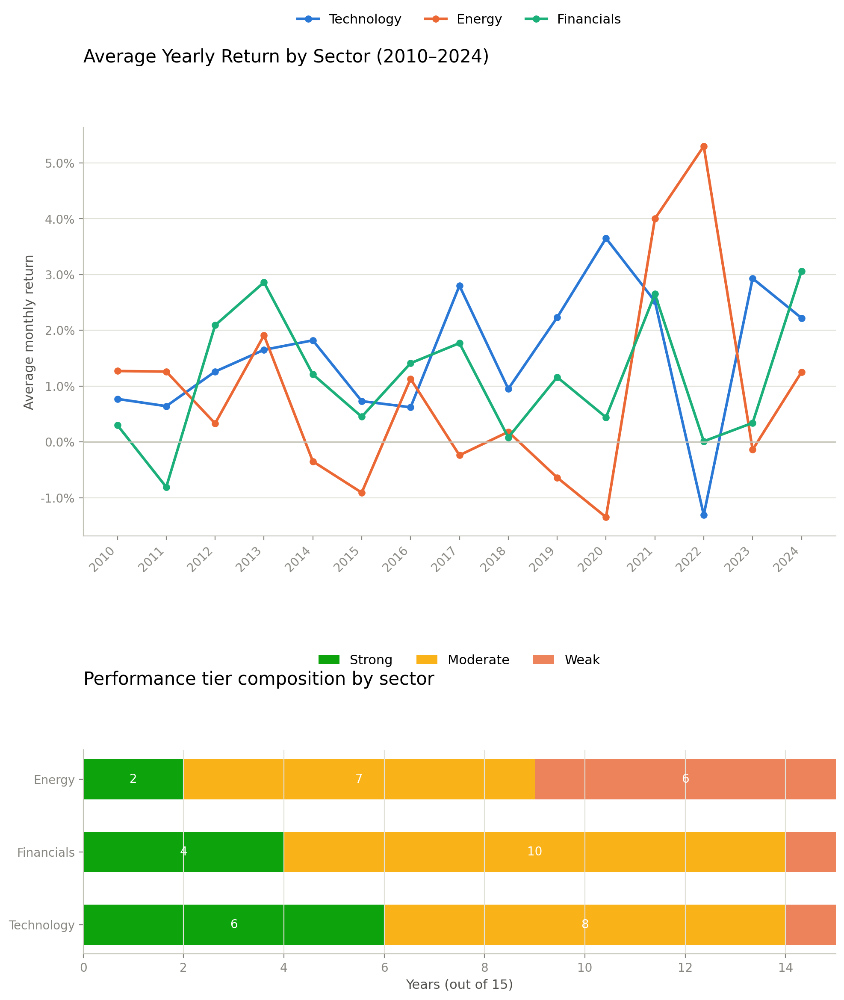

# Sector Performance Analytics

A SQL Server (T-SQL) analysis of 15 years of monthly sector ETF returns, exploring risk, rotation, and momentum across Technology, Energy, and Financials.

**Dataset:** `sector_returns` — 180 rows (monthly observations, 2010-2024) with return values for three sectors.

**Units:** Returns are the average monthly return per year, shown as a percentage (1.57 = 1.57%). Volatility is the standard deviation of monthly returns within that year — not annualized.

## What this analyzes

**Q1 - Which sector had the best risk-adjusted performance overall?**
*Technique: `AVG`, `STDEV`*
Technology had the best risk/reward (return 1.57, volatility 5.50); Energy was worst (return 0.86, volatility 7.79).

**Q2 - Which year was Technology's best and worst?**
*Technique: `TOP 1`, `ORDER BY`*
Technology peaked in 2020, tied to the COVID-19 remote-work and cloud-computing surge.

**Q3 - Which sector led in each individual year?**
*Technique: `UNION ALL`, `RANK() OVER (PARTITION BY)`*
Sector leadership rotates over time: Energy and Financials led in the early 2010s, Technology dominated 2014-2019 and peaked again in 2020, Energy surged back in 2021-2022, and Technology/Financials retook the lead in 2023-2024.

**Q4 - How much did each sector change year over year?**
*Technique: `LAG() OVER (PARTITION BY)`*
Energy shows a sharp boom-bust cycle (+5.30 in 2022, then -5.43 in 2023). Technology dropped -3.83 during the 2022 tech selloff.

**Q5 - How would you classify each sector-year's performance?**
*Technique: `CASE WHEN`*
Technology had the most "Strong" years (6 of 15). Financials was the most stable, landing in "Moderate" 10 of 15 years. Energy was the most volatile, swinging between "Weak" years and sharp "Strong" spikes.

## Why this matters

Sector leadership isn't static - it rotates with macro conditions (COVID-era tech demand, post-COVID energy and inflation shocks). This kind of rotation and risk analysis is directly relevant to roles in financial analysis, risk management, and portfolio strategy.

## Visualization

## Tools

SQL Server (T-SQL) in SSMS. Techniques used: aggregate functions, `GROUP BY`, `TOP N`, window functions (`RANK()`, `LAG()`, `PARTITION BY`), CTEs (`WITH ... AS`), and `CASE WHEN` classification.

See `sector_performance_analytics.sql` for the full, commented queries and findings.
